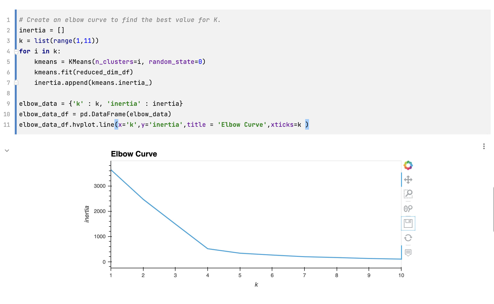
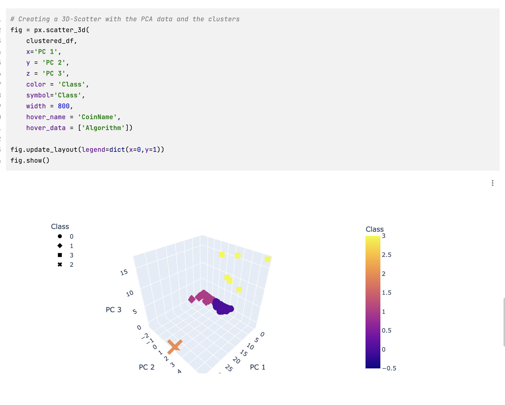
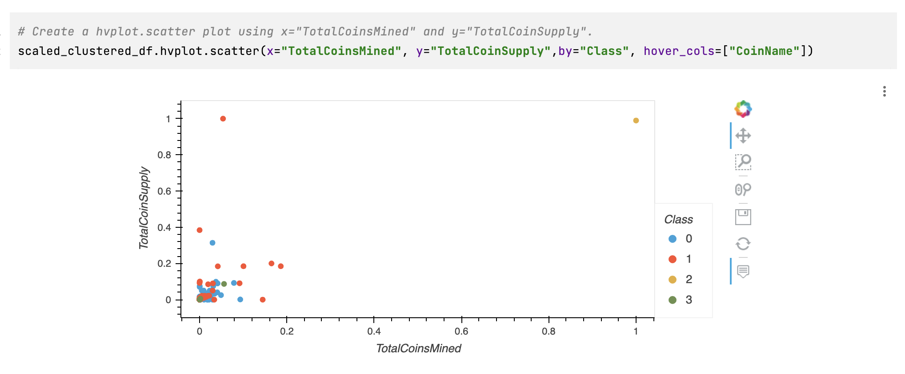

# Crypto_Currencies

## Purpose: 
1. Process Data for PCA 
2. Reduce Data Dimensions using PCA 
3. Clustering Cryptocurrencies using K-means 
4. Visualize Cryptocurrencies Results 

## Results: 
> NOTE: the workbook doesn't bring these diagram along so they are screenshooted.. 

#### Elbow Curve

#### 3D Scatter Plot 

#### Scatter Plot 
